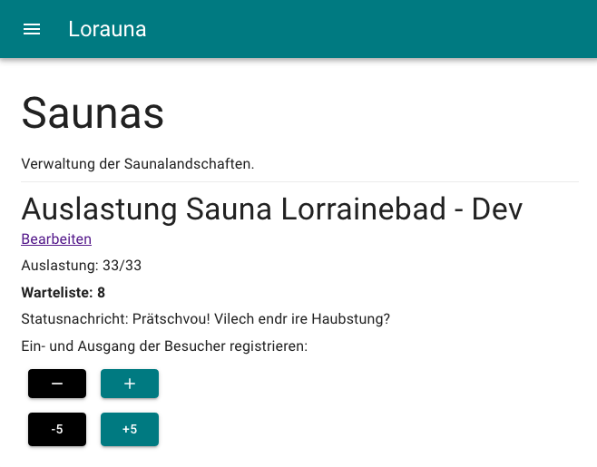

# Lorauna

Lorauna is a web application for the administration of a sauna landscape. The association Sauna Lorrainebad runs several saunas in the Lorrainebad Bern during winter. The app is used to register visitors' entrances and exits and to record temperatures in the sauna.



## Env config

Running the application requires the following environment variables:

```
REACT_APP_APOLLO_URL=/api
```

They can be provided with a [.env file](https://github.com/motdotla/dotenv).

# Changelog

All notable changes to this project will be documented in this file.

The format is based on [Keep a Changelog](https://keepachangelog.com/en/1.0.0/),
and this project adheres to [Semantic Versioning](https://semver.org/spec/v2.0.0.html).

## [1.0.0] - 2019-10-28
### Added
- The lorauna-api project has been integrated into this repository.